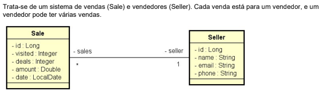

Java Spring Professional 

DESAFIO: - JPA, consultas SQL e JPQL

# Aluno : Marcio Coelho Pereira do Carmo Neto 

"Você deverá implementar as seguintes consultas (ambas deverão estar corretas):"

#### 1- Relatório de vendas
1. [IN] O usuário informa, opcionalmente, data inicial, data final e um trecho do nome do vendedor.
2. [OUT] O sistema informa uma listagem paginada contendo id, data, quantia vendida e nome do
   vendedor, das vendas que se enquadrem nos dados informados.
   Informações complementares:
    - Se a data final não for informada, considerar a data atual do sistema.
    - Se a data inicial não for informada, considerar a data de 1 ano antes da data final.
    - Se o nome não for informado, considerar o texto vazio.

#### 2-  Sumário de vendas por vendedor

1. [IN] O usuário informa, opcionalmente, data inicial, data final.
2. [OUT] O sistema informa uma listagem contendo nome do vendedor e soma de vendas deste vendedor
   no período informado.
   Informações complementares:
   - As mesmas do caso de uso Relatório de vendas

### Critérios de correção:
https://www.getpostman.com/collections/dea7904f994cb87c3d12

Mínimo para aprovação: 4 de 4
- Sumário de vendas por vendedor passando argumentos minDate e maxDate deve retornar os dados previstos no enunciado
  (eliminatório)

- Sumário de vendas por vendedor sem passar argumentos deve retornar os dados dos últimos 12 meses
  (eliminatório)

- Relatório de vendas sem passar argumentos deve retornar vendas dos últimos 12 meses
  (eliminatório)

- Relatório de vendas passando argumentos minDate e maxDate deve retornar os dados previstos no enunciado

### Competências avaliadas:
- Realização de casos de uso

- Criação de endpoints de API Rest com parâmetros de consulta opcionais

- Implementação de consultas em banco de dados relacional com Spring Data JPA

